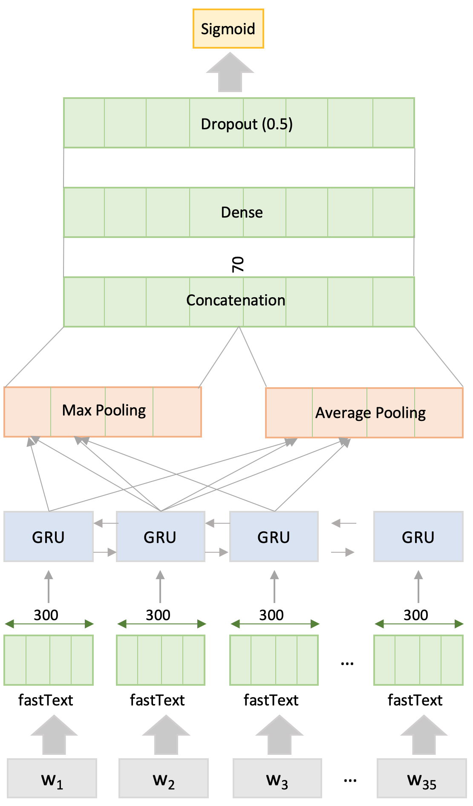

# Emotion Detection Model

This is the code for training an emotion detection model using GRU presented in:

___
## Train your own model

Requirements (tested with):
- *Python 3.6*
- *Numpy 1.14.5*
- *Pandas 0.24.1*
- *Sklearn 0.19.0*
- *Tensorflow 2.0.0-beta1*

### Installation:

    pip install -r requirements.txt

### To run:

After downloading/cloning, put the dataset in the data folder. 

To use the dataset in the paper you can download tweets based on their tweet ids available with their classes in `./data/` and remove the hashtags at the end of each tweets. The final dataset should have the following format: `id, text, emotion` with one record (tweet) per line.

The embedding file should be placed in `./vectorss/`

Use the `configuration.cfg` to set the name of dataset and embedding file, maximun numer in the vocabulary (max_features), maximum length of terms in the text (maxlen), bactch size and number of epochs to run the training. 

Then run the `handler.py`:

    python handler.py

### Google-Colab

You can use `handler.ipynb` in order to use in google-colab or jupyter notebook.

---
## Testing

You can download the trained models used for the paper at: https://drive.google.com/open?id=1TXEbHMTA_AWPFC8bbt7WiBtfT3jVy8cG . 

To run, put the test file into the data forlder. test file should be one tweet per line with no additional columns. set the name of the file in `test_configuration.cfg` and run `handler-test.py`. 

## Citation
Please use the following citation when using the code or the paper:

@article{seyeditabari2019emotion,
  title={Emotion Detection in Text: Focusing on Latent Representation},
  author={Seyeditabari, Armin and Tabari, Narges and Gholizadeh, Shafie and Zadrozny, Wlodek},
  journal={arXiv preprint arXiv:1907.09369},
  year={2019}
}
